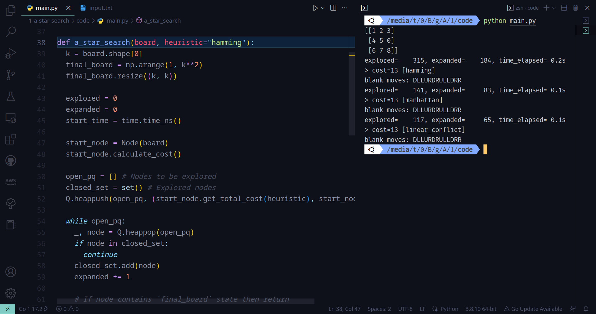
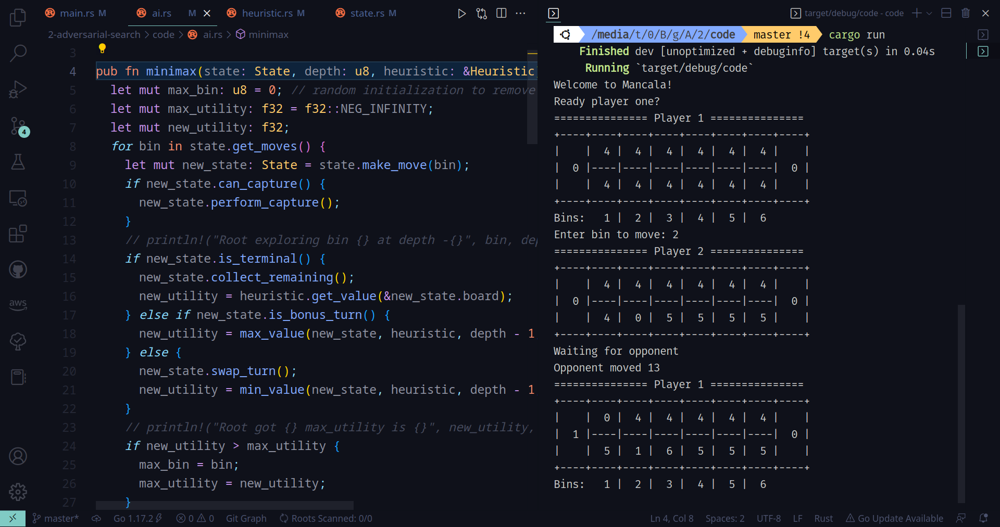
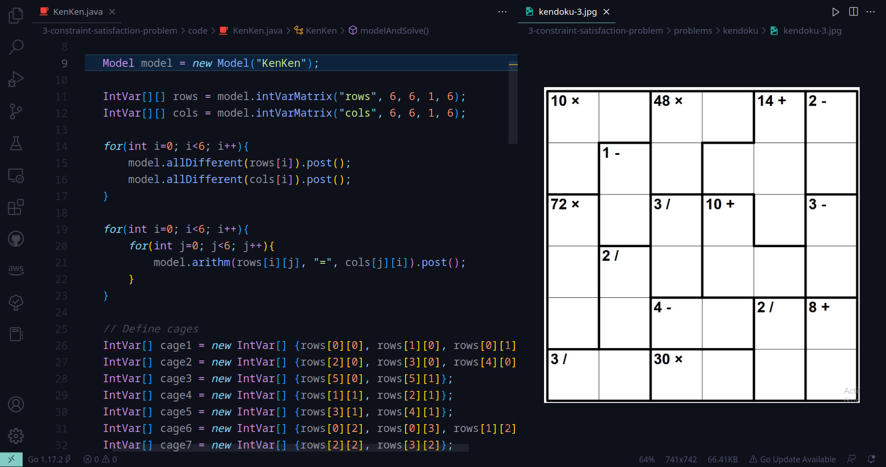
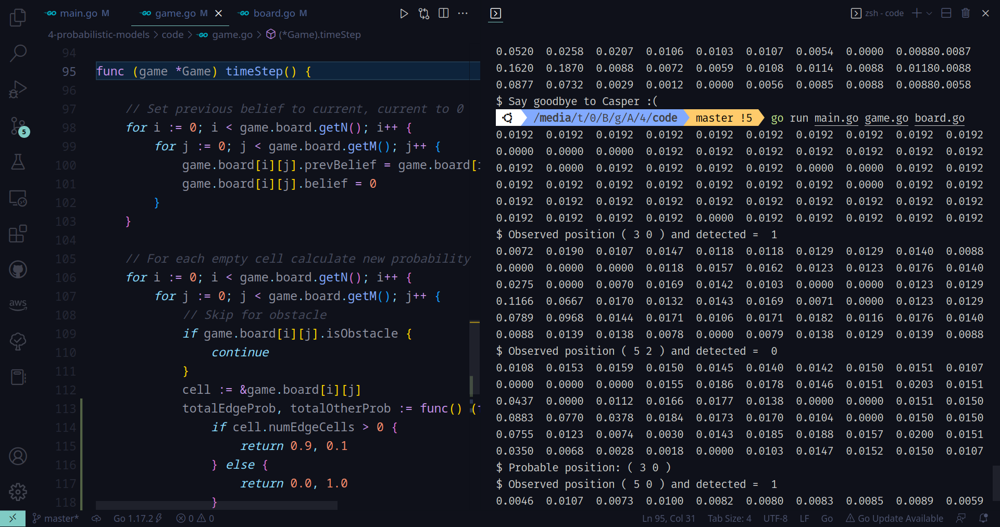

# Artificial Intelligence

Topic | Game | Language
:--- | :---: | ---:
A* Search | N-puzzle | `python`
Adversarial Search | Mancala | `rust`
Constraint Satisfaction | Sudoku, KenKen | `java`
Probabilistic Models | Find Casper | `go`

*P.S. No restrictions on prog lang so ¯\\\__(ツ)\_/¯*

## Offline 1: A* Search Algorithm

**Instructions**: [[PDF]](/1-a-star-search/instructions.pdf)

**Implementation**: N-puzzle solver [[Code]](/1-a-star-search/code)

**Run**: `python main.py`

## Offline 2: Adversarial Search (Minimax with Alpha-Beta pruning)

**Instructions**: [[PDF]](/2-adversarial-search/instructions.pdf)

**Implementation**: Mancala game AI [[Code]](/2-adversarial-search/code)

**Report**: AI vs AI games varying depth, heuristic [[PDF]](/2-adversarial-search/report.pdf)

**Run**: `cargo run` (Requires `rust` & `cargo` installed)

## Offline 3: Constraint Satisfaction Problem

**Problems**: [[Images]](/3-constraint-satisfaction-problem/problems)

**Implementation**: Sudoku (+variations), KenKen [[Code]](/3-constraint-satisfaction-problem/code)

**Run**: Setup java project with [choco-solver](https://choco-solver.org/) library

## Offline 4: Probabilistic Models

**Instructions**: [[PDF]](/4-probabilistic-models/instructions.pdf)

**Implementation**: Find Casper [[Code]](/4-probabilistic-models/code)

**Run**: `go run main.go game.go board.go` (Requires `go` installed)
